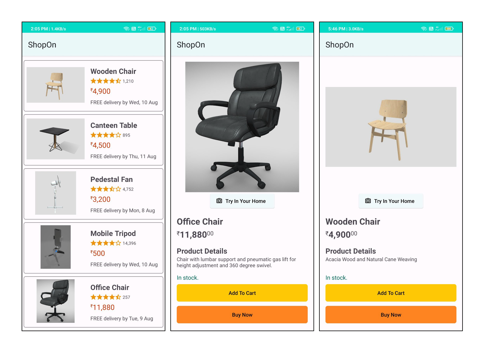
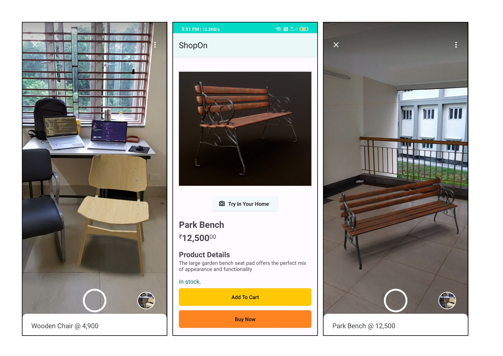
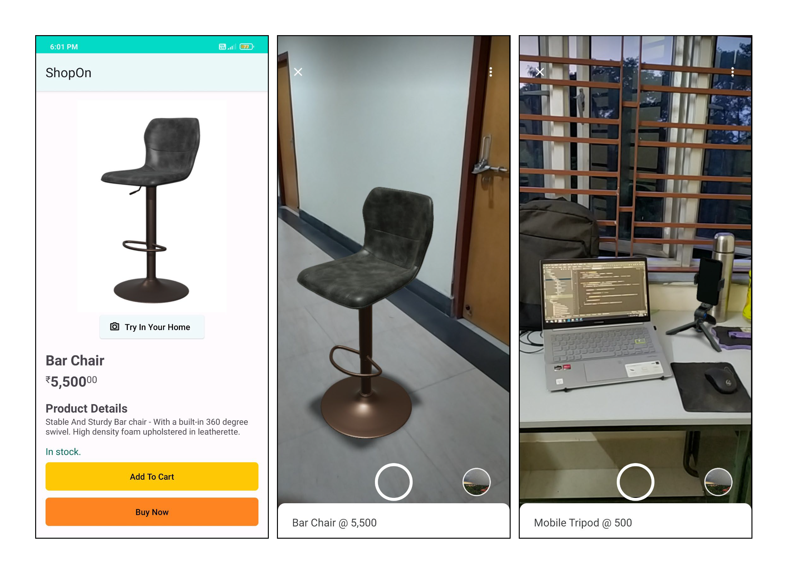

# ShopOn
This is an Android Native application which is developed as a solution for _**HackOn with Amazon 2022**_ for the problem statement related to shopping experience. The detailed problem statement and proposed solution are mentioned furthur in the document.  
Click [here](https://youtu.be/ebxUM9ym_Bw) for the video presentation with app demo.

## Problem Statement:
What is that one thing that has refrained customers from buying online for a long time? One of the prominent differences between traditional and online shopping has been physically experiencing the products, confirming its size, all of which has been a pain point for a very long time while buying any product online. If we could solve this problem of product trials, checking the product dimensions by comparing it with real world objects, we can onboard many customers who doesn’t buy online because of this gap.

## Proposed Solution:
We intend to solve these problems by using the _Augmented Reality (AR) Technology_, through which we’ll target on providing customers with virtual representation analysing the product’s size, fitment, colour theme sync, etc. With the feature of trying out their products virtually through their mobile phones, the gap between the customer and the product will be minimized.

## Screenshots of the application :





## How does it work?
We will be using **SceneViewer** by triggering a explicit intent to it. 
Scene Viewer is an immersive viewer that enables 3D and AR experiences from our Android app. It lets users of our application easily preview, place, view, and interact with web-hosted 3D models in their environment. It uses **ARCore**, which is Google’s platform for building augmented reality experiences. Using different APIs, ARCore enables our application to sense its environment, understand the world and interact with information.

ARCore uses three key capabilities to integrate virtual content with the real world as seen through your phone's camera:
1. **Motion tracking** allows the phone to understand and track its position relative to the world.
2. **Environmental understanding** allows the phone to detect the size and location of all type of surfaces: horizontal, vertical and angled surfaces like the ground, a coffee table or walls.
3. **Light estimation** allows the phone to estimate the environment's current lighting conditions.

## How quick can this technology be implemented ?
Our solution can be instantly be brought to production with the existing shopping applications for different products.

## What is the impact of this solution ?
The impact of adding this feature will be huge, as we’ve now reduced the gap between our customers and the actual product. More and more people would be eager to try the product and ultimately increase the sales by a very large factor.

## Is the solution scalable ?
The solution is highly scalable as it can be implemented with the existing shopping applications.

## Business Relevance :
After bringing the idea to production, more and more users will be tempted to check out the products and the transition barrier from traditional offline buying to online would be reduced, thus increasing the sales.

## Use this application : 

1. You can download the [APK](https://drive.google.com/file/d/1jXiykk2tw-S18ywyPzSPNj8OBwTRiybX/view?usp=sharing), and then install it (you might have to enable installation from unknown sources).

2. Or you can clone the repository and import in Android Studio to see the code + build the APK.

```bash
git clone https://github.com/akshatkverma/ShopOn.git
```

## Future Scope:
The option for virtual try on/ see in your room can be made available for more and more products by making a separate application for making 3D models by just scanning the object by mobile phone’s camera, which currently requires a professional to make 3D models using heavy graphical softwares. Continuous improvement can be made to the AR technology, making the items even more realistic and improving the overall experience.

# Team Details :
**Team Name** : Lifetime Error

**Team Members**:
1. [Akshat Kumar Verma](https://www.linkedin.com/in/akshatkumarverma/)
2. [Mayur Ray](https://www.linkedin.com/in/raymayur9/)
3. [Afzal Ansari](https://www.linkedin.com/in/afzal-ansari-910b38200/)
4. [Sharad Shaiwal](https://www.linkedin.com/in/sharad-shaiwal-590b89201/)
